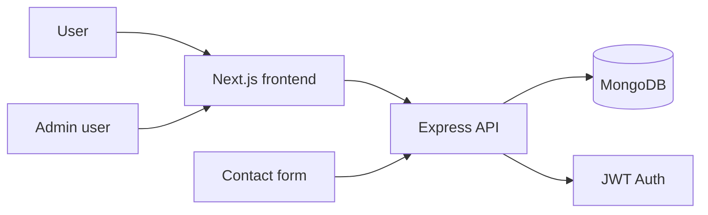

# Silent House

## Project overview
This repository preserves the original Silent House marketing website while adding a working Node.js + Express API, MongoDB persistence, JWT authentication, and admin inquiry management. The frontend remains a Next.js application, and the existing homepage design, content, images, and motion behavior are left intact as the primary user experience.

## Original Silent House functionality preserved
The original website remains visually and content-wise intact, including:
- the homepage layout and copy
- the navigation structure and labels
- the hero, featured work, divisions, press, and types-of-work sections
- the existing styling system and GSAP/Lenis-based motion behavior
- the branded footer and links
- existing media references and site structure

## New functionality added
- user signup and login pages
- protected dashboard for authenticated users
- admin-only inquiry management panel
- MongoDB-backed inquiry submission and tracking
- JWT-based authentication with bcrypt password hashing
- seed data for testing users, admin user, inquiry records, and example content
- real frontend-to-backend API integration

## Frontend technology
- Next.js 16
- React 19
- JavaScript
- CSS with Tailwind utility integration kept compatible with the existing design

## Backend technology
- Node.js
- Express.js
- MongoDB
- Mongoose
- JWT
- bcryptjs
- dotenv
- CORS

## MongoDB setup
MongoDB should run locally on your Windows machine. The backend is configured to connect to:

```bash
mongodb://127.0.0.1:27017/silent_house
```

You can start MongoDB locally using the standard MongoDB service command on your system or the installed `mongod` binary if available.

## Architecture
The app is structured as a monorepo-style project with a Next.js frontend and a separate Express backend.



## Folder structure
```text
silent-house/
├── app/
│   ├── admin/
│   ├── components/
│   ├── contact/
│   ├── dashboard/
│   ├── login/
│   ├── signup/
│   ├── lib/
│   ├── globals.css
│   ├── layout.js
│   └── page.js
├── backend/
│   ├── scripts/
│   ├── src/
│   ├── .env.example
│   ├── package.json
│   └── server.js
├── .env.example
├── jsconfig.json
├── next.config.mjs
├── package.json
├── postcss.config.mjs
├── README.md
└── public/
```

## Installation steps
1. Install frontend dependencies:
   ```bash
   npm install
   ```
2. Install backend dependencies:
   ```bash
   cd backend
   npm install
   ```
3. Create environment files:
   ```bash
   copy .env.example .env
   copy backend\.env.example backend\.env
   ```
4. Update both `.env` files with your local values if needed.

## Environment variables
Frontend `.env`:
```env
NEXT_PUBLIC_API_URL=http://localhost:5000/api
```

Backend `backend/.env`:
```env
MONGODB_URI=mongodb://127.0.0.1:27017/silent_house
PORT=5000
JWT_SECRET=change_this_secret_value
CLIENT_URL=http://localhost:3000
```

## How to start MongoDB
On a local Windows machine with MongoDB installed:

```powershell
mongod
```

If MongoDB is installed as a service, you can also start the MongoDB service from Windows Services or the MongoDB shell setup.

## How to start backend
```bash
cd backend
npm run dev
```

The backend runs on:
```text
http://localhost:5000
```

## How to start frontend
```bash
npm run dev
```

The frontend runs on:
```text
http://localhost:3000
```

## How to seed MongoDB
```bash
cd backend
npm run seed
```

This creates:
- 3 test users
- 1 admin user
- multiple inquiry records
- sample project/content records

## Test credentials
```text
User account:
- email: ava@example.com
- password: password123

Admin account:
- email: admin@silent-house.com
- password: admin123
```

## API endpoint list
### Authentication
- `POST /api/auth/signup`
- `POST /api/auth/login`
- `GET /api/auth/me`

### Projects/content
- `GET /api/projects`
- `GET /api/projects/:id`

### Inquiries
- `POST /api/inquiries`

### Admin only
- `GET /api/admin/inquiries`
- `PATCH /api/admin/inquiries/:id`
- `DELETE /api/admin/inquiries/:id`

### Health check
- `GET /api/health`

## Authentication explanation
Authentication uses JWTs issued after successful login or signup. The token is stored in the browser local storage and sent in the `Authorization: Bearer <token>` header for protected API requests. The backend validates the JWT and attaches the authenticated user to each protected request. Admin-only routes check the user's role before allowing access.

## Validation and error handling
The application validates:
- required fields
- invalid email formats
- password length and confirmation mismatch
- duplicate signups
- invalid login attempts
- unauthorized access and missing JWT
- admin-only API restrictions
- failed API requests
- empty states and loading states in the UI

Sensitive details such as raw stack traces, database errors, or secrets are not exposed to the user.

## Security considerations
- bcrypt password hashing
- JWT expiry (7 days)
- environment variables for secrets and API URL
- CORS enabled for the local frontend
- protected routes and admin authorization
- no plaintext password storage
- `.env` files ignored by git

## Testing instructions
1. Start MongoDB.
2. Start backend: `cd backend && npm run dev`
3. Start frontend: `npm run dev`
4. Seed database: `cd backend && npm run seed`
5. Create a new user at `/signup`.
6. Log in via `/login`.
7. Visit the dashboard and verify protected access.
8. Submit an inquiry from `/contact`.
9. Log in as admin and verify the `/admin` panel.
10. Update and delete inquiry records.
11. Run a frontend production build: `npm run build`
12. Confirm the app starts without runtime errors.

## Known limitations
- This is a local development implementation and not yet deployed to production.
- The original homepage remains static marketing content; the dynamic data layer focuses on auth and inquiry workflows.
- The project content is deliberately lightweight for this assignment and can be expanded further as needed.

## Future improvements
- add richer project and case-study pages tied to MongoDB records
- add admin user management and audit logs
- add email notifications for inquiries
- add pagination and filtering for admin inquiry lists
- add automated tests with Jest or Playwright

## AI tools used
- GitHub Copilot
- VS Code integrated tooling
- Next.js and Node.js runtime verification

---

This documentation reflects the final project state and the commands that were verified in the repository.
