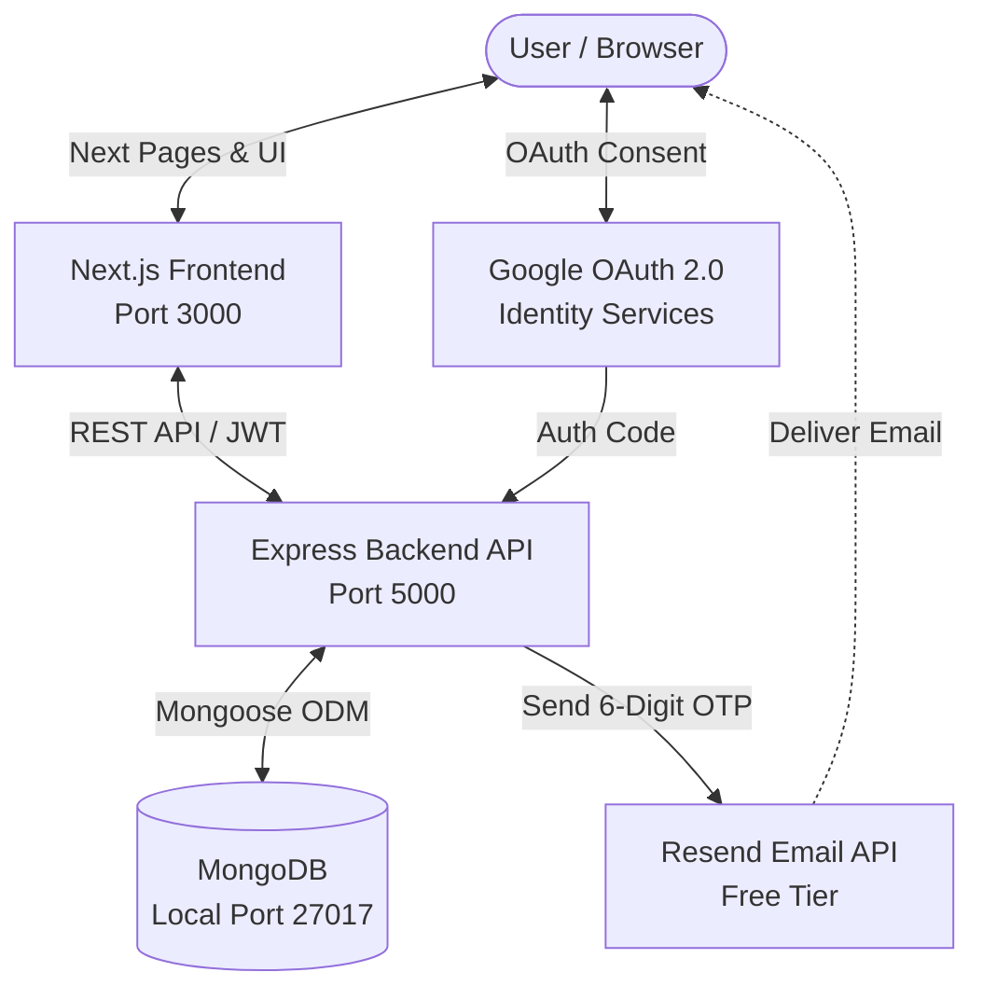

# Silent House

## Project Overview
This repository preserves the original Silent House marketing website while integrating a robust Node.js + Express backend, MongoDB persistence, JWT authentication, **Email OTP verification during signup**, **Google OAuth 2.0 authentication ("Continue with Google")**, **Admin Inquiry Management**, and **Admin User Management**.

The frontend remains a modern Next.js application, preserving the original homepage layout, branding, typography, images, videos, Lenis smooth scrolling, and GSAP motion behaviors without any regressions.

---

## Original Silent House Functionality Preserved
The original website remains visually and functionally intact, including:
- Homepage layout, hero typography, and copy
- Navigation bar, logo icon, and interactive modals (Work, Studios, Productions, Touring, About, Reel, Let's talk)
- Hero, Featured Work, Divisions, Press, and Types of Work sections
- GSAP and Lenis smooth scrolling motion behavior
- Header color adaptation when scrolling over light/dark sections
- Branded footer, contact drawer, and asset paths

---

## Features Added

### 1. Email OTP Verification During Signup (Feature 1)
- User enters details (Name, Email, Password, Confirm Password).
- Account is **NOT** created until the email is verified via a 6-digit OTP.
- OTP is sent using **Resend** (free-tier transactional email API).
- Temporary registration data is held in a dedicated `OtpVerification` collection with:
  - Bcrypt-hashed password (plaintext is never stored).
  - Bcrypt-hashed OTP (plaintext is never stored).
  - 10-minute expiration with MongoDB TTL auto-cleanup.
  - Attempt counter (invalidated after 5 failed attempts).
  - 60-second cooldown timer between resend requests.
- **Local Dev Fallback**: If `RESEND_API_KEY` is not yet configured, the OTP is printed directly to the terminal console (`[EMAIL SERVICE DEV SIMULATION]`) so development is never blocked.

### 2. Google OAuth 2.0 Signup (Feature 2)
- "Continue with Google" button on the signup page.
- Direct integration with Google Cloud OAuth 2.0 / OpenID Connect endpoints.
- Verifies identity, retrieves verified email, and checks MongoDB:
  - Creates user with **strictly `role: 'user'`** and `emailVerified: true`.
  - Links Google identity (`googleId`) to existing accounts if present.
  - Prevents privilege escalation (cannot create admin accounts through OAuth).
- Issues session JWT and seamlessly redirects into the application.

### 3. Admin User Management Panel (`/manage`)
- Accessible from the navbar profile menu for authenticated administrators.
- Authoritative backend authorization check (`/api/auth/me`).
- Lists all registered users with name, email, role, and registration date.
- Modal to create new user or administrator accounts with validation.
- Modal to delete users with protection preventing deletion of your own account or the last remaining administrator.

### 4. Admin Inquiry Management Panel (`/admin`)
- Lists inquiries submitted through the contact modal/page.
- Filter and update inquiry statuses (`pending`, `contacted`, `completed`).
- Delete obsolete inquiry submissions.

### 5. Authentication & Session Architecture
- JWT tokens with 7-day expiration.
- Dual storage: HTTP-only cookie + `localStorage` via client-side `AuthGate`.
- Bcrypt password hashing (10 salt rounds).
- Protected user dashboard (`/dashboard`).
- Safe logout clearing both client storage and auth cookies.

---

## Technology Stack

### Frontend
- **Framework**: Next.js 16 (App Router)
- **UI Library**: React 19
- **Styling**: Tailwind CSS + Custom CSS (`globals.css`)
- **Animations**: GSAP 3 + Lenis Smooth Scroll

### Backend
- **Runtime**: Node.js (v18+)
- **Server Framework**: Express 4
- **Database**: MongoDB + Mongoose 8
- **Authentication**: JSON Web Tokens (`jsonwebtoken`) + `bcryptjs`
- **Email Provider**: Resend (`resend`)
- **OAuth**: Google OAuth 2.0 / OpenID Connect

---

## Architecture Diagram



---

## Folder Structure

```text
silent-house/
├── app/
│   ├── admin/               # Admin inquiries dashboard
│   ├── auth/
│   │   └── callback/        # Google OAuth callback handler page
│   ├── components/          # Header, Footer, AuthGate, Hero, Modals, etc.
│   ├── contact/             # Contact inquiry submission page
│   ├── dashboard/           # Authenticated user dashboard
│   ├── home/                # Authenticated landing page
│   ├── lib/
│   │   └── api.js           # Frontend API client and auth storage
│   ├── login/               # Existing login page
│   ├── manage/              # Admin user management panel
│   ├── signup/              # Signup page with OTP verification & Google button
│   ├── globals.css          # Design system, themes, and auth styles
│   ├── layout.js            # Root layout wrapped in AuthGate
│   └── page.js              # Original homepage
├── backend/
│   ├── scripts/
│   │   ├── seed.js          # Database seeder (users, inquiries, projects)
│   │   └── test-features.js # Automated E2E verification test suite
│   ├── src/
│   │   ├── config/
│   │   │   └── db.js        # MongoDB connection handler
│   │   ├── middleware/
│   │   │   └── auth.js      # protect and adminOnly JWT middleware
│   │   ├── models/
│   │   │   ├── Inquiry.js   # Inquiry model
│   │   │   ├── OtpVerification.js # Temporary OTP verification model with TTL
│   │   │   ├── Project.js   # Portfolio project model
│   │   │   └── User.js      # User model (roles, authProvider, emailVerified)
│   │   ├── routes/
│   │   │   ├── adminRoutes.js   # Admin inquiries and user management routes
│   │   │   ├── authRoutes.js    # Auth, OTP, and Google OAuth endpoints
│   │   │   ├── inquiryRoutes.js # Public inquiry submission
│   │   │   └── projectRoutes.js # Project data endpoints
│   │   └── services/
│   │       └── emailService.js  # Resend transactional email integration
│   ├── .env.example
│   ├── package.json
│   └── server.js            # Express server entry point
├── .env.example
├── next.config.mjs
├── package.json
└── README.md
```

---

## Installation & Setup

### 1. Prerequisites
- **Node.js**: v18.0.0 or higher
- **MongoDB**: Community Server running locally on `localhost:27017`

### 2. Install Dependencies
In the root directory (frontend):
```powershell
npm install
```

In the `backend` directory:
```powershell
cd backend
npm install
cd ..
```

### 3. Configure Environment Variables

**Frontend (`.env` in repository root)**:
```env
NEXT_PUBLIC_API_URL=http://localhost:5000/api
```

**Backend (`backend/.env`)**:
```env
MONGODB_URI=mongodb://127.0.0.1:27017/silent_house
PORT=5000
JWT_SECRET=silent-house-dev-secret
CLIENT_URL=http://localhost:3000

# Free Transactional Email Provider (Resend - https://resend.com)
# Sign up free for 3,000 emails/month (no credit card required)
# In development, leave blank to use the terminal console simulation
RESEND_API_KEY=
EMAIL_FROM=Silent House <onboarding@resend.dev>

# Google OAuth 2.0 (Google Cloud Console - https://console.cloud.google.com)
GOOGLE_CLIENT_ID=
GOOGLE_CLIENT_SECRET=
GOOGLE_CALLBACK_URL=http://localhost:5000/api/auth/google/callback
```

---

## Running the Application

### 1. Start MongoDB
Ensure the MongoDB service is active on your machine:
```powershell
# If installed as a Windows service:
net start MongoDB

# Or run the binary manually:
mongod
```

### 2. Start the Backend API
```powershell
cd backend
npm run dev
```
*API runs at `http://localhost:5000`*

### 3. Start the Frontend
In a new terminal window:
```powershell
npm run dev
```
*Frontend runs at `http://localhost:3000`*

### 4. Seed Initial Data (Optional)
To populate test inquiries, projects, and sample users:
```powershell
cd backend
npm run seed
```

---

## Test Credentials

| Account Role | Email | Password | Access Level |
| :--- | :--- | :--- | :--- |
| **Standard User** | `ava@example.com` | `password123` | Homepage, Dashboard, Contact |
| **Standard User** | `noah@example.com` | `password123` | Homepage, Dashboard, Contact |
| **Administrator** | `admin@silent-house.com` | `admin123` | Full Access (`/admin`, `/manage`) |

---

## API Endpoints Reference

### Authentication (`/api/auth`)
| Method | Endpoint | Access | Description |
| :--- | :--- | :--- | :--- |
| `POST` | `/send-signup-otp` | Public | Validates signup data, hashes password/OTP, sends 6-digit code |
| `POST` | `/verify-signup-otp` | Public | Verifies OTP code, creates user account, sets auth session |
| `POST` | `/resend-signup-otp` | Public | Resends OTP with 60-second cooldown enforcement |
| `GET` | `/google` | Public | Initiates Google OAuth 2.0 authorization redirect |
| `GET` | `/google/callback` | Public | Handles OAuth callback, creates/links user, sets session |
| `POST` | `/signup` | Public | Direct signup endpoint (preserved for backward compatibility) |
| `POST` | `/login` | Public | Authenticates user with email & password, returns JWT |
| `GET` | `/me` | User / Admin | Returns current authenticated user profile |
| `POST` | `/logout` | Authenticated | Clears auth cookie and session |

### Admin User Management (`/api/admin/users`)
| Method | Endpoint | Access | Description |
| :--- | :--- | :--- | :--- |
| `GET` | `/` | Admin Only | Lists all registered users (excluding password hashes) |
| `POST` | `/` | Admin Only | Creates a new user or administrator account |
| `DELETE` | `/:id` | Admin Only | Deletes user (blocks self-deletion and last admin deletion) |

### Admin Inquiry Management (`/api/admin/inquiries`)
| Method | Endpoint | Access | Description |
| :--- | :--- | :--- | :--- |
| `GET` | `/` | Admin Only | Lists all submitted inquiries sorted by date |
| `PATCH` | `/:id` | Admin Only | Updates inquiry status (`pending`, `contacted`, `completed`) |
| `DELETE` | `/:id` | Admin Only | Deletes an inquiry record |

### Public Inquiries & Projects
| Method | Endpoint | Access | Description |
| :--- | :--- | :--- | :--- |
| `POST` | `/api/inquiries` | Public | Submits a contact inquiry |
| `GET` | `/api/projects` | Public | Lists featured portfolio projects |
| `GET` | `/api/projects/:id` | Public | Retrieves specific project details |
| `GET` | `/api/health` | Public | Health check endpoint |

---

## Testing & Verification

### Automated Test Suite
A dedicated verification test suite checks all OTP flows, cooldowns, attempt limits, and regression cases:
```powershell
cd backend
npm test
```

This automated test executes:
1. Form validation & missing field rejection (400)
2. Duplicate email rejection (409)
3. Secure OTP generation & hashing in MongoDB
4. Resend rate limiting / 60s cooldown (429)
5. Invalid OTP attempt tracking (400)
6. Correct OTP verification & account creation with `role: 'user'` (201)
7. Login with newly created user
8. Regression test: existing user login (`ava@example.com`)
9. Regression test: admin login & user management API (`admin@silent-house.com`)
10. Google OAuth unconfigured credentials safety redirect

### Production Build Test
Verify that Next.js compiles without build or TypeScript errors:
```powershell
npm run build
```

---

## Google Cloud OAuth Setup Guide

If you wish to test real Google authentication in development:
1. Open the [Google Cloud Console](https://console.cloud.google.com).
2. Create or select a project.
3. Configure the **OAuth consent screen** (User Type: External, add `openid`, `email`, and `profile` scopes).
4. Go to **Credentials** > **Create Credentials** > **OAuth client ID** (Application Type: Web application).
5. Add Authorized redirect URI:
   ```text
   http://localhost:5000/api/auth/google/callback
   ```
6. Copy the Client ID and Client Secret into `backend/.env`.

---

## Security Features Implemented
- **Pre-hashed Storage**: Neither passwords nor OTPs are ever stored in plaintext.
- **MongoDB TTL**: Verification records expire and automatically delete after 10 minutes.
- **Attempt Limiting**: Max 5 attempts per OTP before the code is permanently invalidated.
- **Resend Cooldown**: 60-second cooldown enforced between resend requests.
- **Role Safeguards**: OAuth registration strictly assigns `role: 'user'`. Frontend cannot dictate user role.
- **Admin Safeguards**: Self-deletion and deletion of the last remaining administrator account are blocked.
